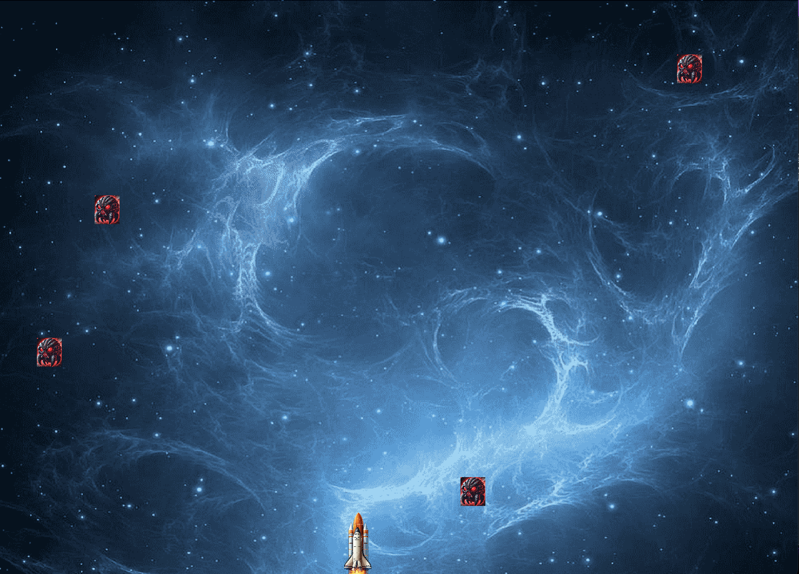

<br />
<div align="center">
  <a href="https://github.com/kaanbalta/SpaceGame">
    
  </a>

  <h3 align="center">SpaceGame</h3>

  <p align="center">
    A database-supported space game developed with Java.
    <br />
    <a href="https://github.com/kaanbalta/SpaceGame"><strong>View Code »</strong></a>
    <br />
    <br />
    <a href="https://github.com/kaanbalta/SpaceGame/issues">Report Bug</a>
    ·
    <a href="https://github.com/kaanbalta/SpaceGame/issues">Request Feature</a>
  </p>
</div>

<details>
  <summary>Table of Contents</summary>
  <ol>
    <li>
      <a href="#about-the-project">About The Project</a>
      <ul>
        <li><a href="#built-with">Built With</a></li>
      </ul>
    </li>
    <li>
      <a href="#getting-started">Getting Started</a>
      <ul>
        <li><a href="#prerequisites">Prerequisites</a></li>
        <li><a href="#installation">Installation</a></li>
      </ul>
    </li>
    <li><a href="#gameplay">Gameplay</a></li>
    <li><a href="#contact">Contact</a></li>
  </ol>
</details>

## About The Project

SpaceGame is a classic arcade game developed using Java. The goal of the game is to control the spaceship, shoot down falling meteors, and achieve the highest score.

The game utilizes a MySQL database to store player data and scores. Players can register, log in, and save their high scores to the database. Scores are displayed within the game in a records table.

### Built With

This project was developed using the following technologies and libraries:

* 
* 
* 
* 
* 

## Getting Started

To get a local copy up and running without errors, please follow these simple steps.

### Prerequisites

* **Java JDK** (Version 8 or higher)
* **XAMPP** (For Apache and MySQL service)
* **Git**

### Installation

1.  **Clone the Repo**
    ```sh
    git clone [https://github.com/kaanbalta/SpaceGame.git](https://github.com/kaanbalta/SpaceGame.git)
    ```

2.  **Database Setup (Critical Step!)**
    * Open XAMPP Control Panel and start **Apache** and **MySQL** services.
    * Go to `http://localhost/phpmyadmin` in your browser.
    * Click **New** on the left menu and create a database named exactly: **`demo`**
    * Select the created `demo` database, then go to the **Import** tab.
    * Choose the **`Spacegame.sql`** file from the project folder and import it.
    * *(Note: Database username is set to `root` and password is `empty`. This matches standard XAMPP settings.)*

3.  **Library Configuration**
    * Open the project in IntelliJ IDEA (or your preferred IDE).
    * Add the **`mysql-connector-j-9.0.0.jar`** file located in the project root to your project dependencies/libraries.
    * *For IntelliJ IDEA:* Go to `File > Project Structure > Modules > Dependencies > + > JARs or Directories`.

4.  **Run the Game**
    * Run the `Main` class located under the `src` folder.

## Gameplay

* **Movement:** Use **A and D** keys to steer the spaceship left and right.
* **Shooting:** Use the **SHIFT** key to shoot meteors.
* **Objective:** Destroy as many meteors as possible before running out of lives to achieve the highest score.

## Contact

Project Link: [https://github.com/kaanbalta/SpaceGame](https://github.com/kaanbalta/SpaceGame)
